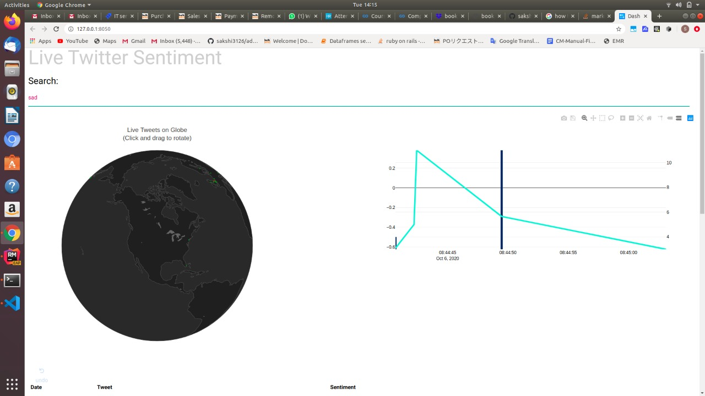

# twitter-data-sentiment-analysis

### Sentiment Analysis also uses Machine Learning   to help organisations look far beyond just the number of likes/shares/comments they get on an ad campaign, blog post, released product, or anything of that nature.

=================================================================================

#### Using Twitter API key to fetch twitter live data to anlayse sentiment of input field. 
####  In this project user can provide text in the input fields and based on the input fields text ...matches that word in twitter data and  using data analysis library sentiment of that text is analysed.

